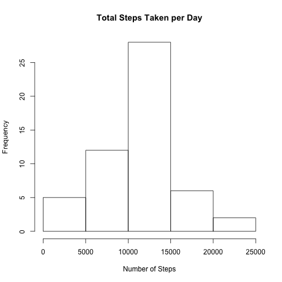
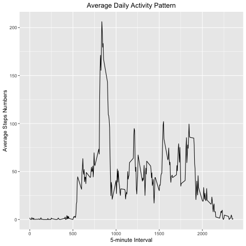
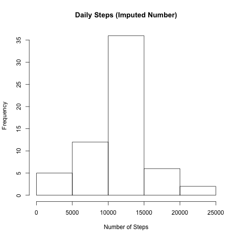
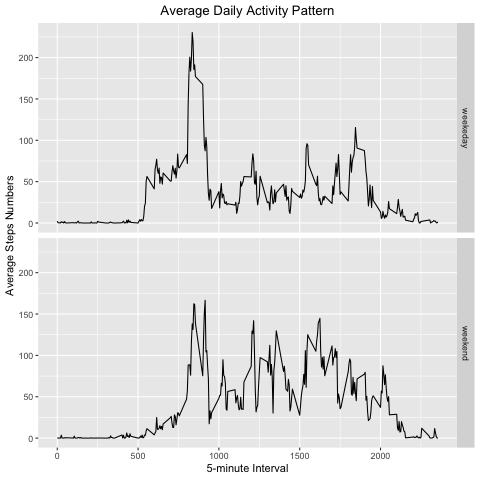

## Loading and preprocessing the data


```r
acData <- read.csv(file = "activity.csv", header = TRUE)
```

## What is mean total number of steps taken per day?

### Calculate total of steps taken per day


```r
tSteps <- aggregate(steps ~ date, acData, FUN = sum)
```

### Histogram of total steps taken per day


```r
hist(tSteps$steps,
      main = "Total Steps Taken per Day",
      xlab = "Number of Steps")
```

<!-- -->

### Mean and median of the total steps taken per day


```r
meanSteps <- mean(tSteps$steps, na.rm = TRUE)
medianSteps <- median(tSteps$steps, na.rm = TRUE)
```

On average, the subject walked 10766.19 steps, with a median value of 10765. And the histogram above shows the total number of steps by day.

## What is the average daily activity pattern?

### Average daily activity pattern


```r
meansin <- aggregate(steps ~ interval, acData, mean)
```

### Loading required package


```r
library(ggplot2)
```

```
## Registered S3 methods overwritten by 'ggplot2':
##   method         from 
##   [.quosures     rlang
##   c.quosures     rlang
##   print.quosures rlang
```

```r
library(hms)
```

### Time series of daily average activity


```r
ggplot(data = meansin, aes(x = interval, y = steps)) +
     geom_line() +
     ggtitle("Average Daily Activity Pattern") +
     xlab("5-minute Interval") +
     ylab("Average Steps Numbers") +
     theme(plot.title = element_text(hjust = 0.5))
```

<!-- -->

### Max steps by interval


```r
maxin <- meansin[which.max(meansin$steps), ]
```
According to the output above, the max steps is 206, interval is 835.

## Imputing missing values

### Total number of missing values


```r
mvalue <- is.na(acData$steps)
table(mvalue)
```

```
## mvalue
## FALSE  TRUE 
## 15264  2304
```
The total number of missing value is 2304.

### Imputing missing values


```r
filled_acData <- transform(acData,
     steps = ifelse(is.na(acData$steps),
     meansin$steps[match(acData$interval,
     meansin$interval)],
     acData$steps))
```

### Daily steps after imputing missing data


```r
filled_interval <- aggregate(steps ~ date, filled_acData, FUN = sum)
```

### Histogram of daily steps after imputing missing data


```r
hist(filled_interval$steps,
      main = "Daily Steps (Imputed Number)",
      xlab = "Number of Steps")
```

<!-- -->

### Mean and median of the total steps taken per day after imputing


```r
imMeanSteps <- mean(filled_interval$steps, na.rm = TRUE)
imMedianSteps <- median(filled_interval$steps, na.rm = TRUE)
```
After imputing, the mean is 10766.19 and the median is 10766.19.

## Are there differences in activity patterns between weekdays and weekends?

### Differences in new factors


```r
difMean = imMeanSteps - meanSteps
difMedian = imMedianSteps - medianSteps
difTotal = sum(filled_interval$steps) - sum(tSteps$steps)
```

Accordingly, the difference of mean is 0, median 1.19, total 86129.51.

### New factor variable in the dataset with two levels


```r
Day_type <- function(date) {
         day <- weekdays(date)
         if (day %in% c('Monday', 'Tuesday', 'Wednesday', 'Thursday', 'Friday'))
         return ("weekeday")
         else if (day %in% c('Saturday', 'Sunday'))
         return ("weekend")
         else
         stop ("Invalid Date Format.")
 }
filled_acData$date <- as.Date(filled_acData$date)
filled_acData$day <- sapply(filled_acData$date, FUN = Day_type)
```
 
### Average steps taken by weekdays and weekend

```r
Dailymean <- aggregate(steps ~ interval + day, filled_acData, mean)
```

### Comparison plot of activity pattern between weekdays and weekend

```r
ggplot(data = Dailymean, aes(x = interval, y = steps)) +
         geom_line() +
         facet_grid(day ~ .) +
         ggtitle("Average Daily Activity Pattern") +
         xlab("5-minute Interval") +
         ylab("Average Steps Numbers") +
         theme(plot.title = element_text(hjust = 0.5))
```

<!-- -->

According to the chart, the subject takes more steps on average during the weekday.
